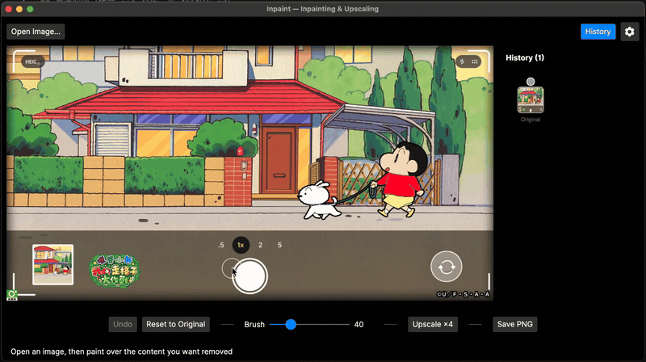
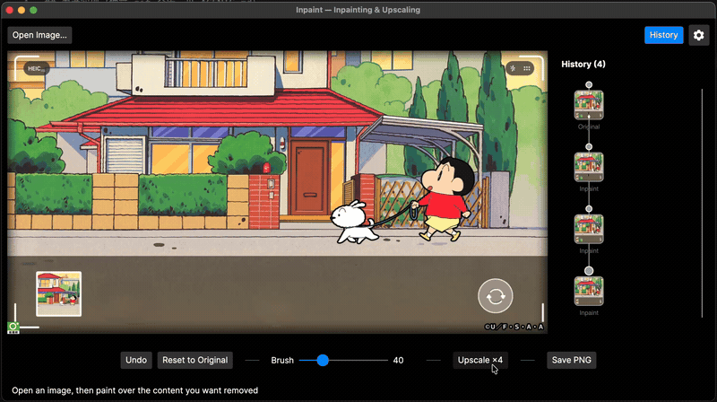

<div align="center">


# Inpaint

**A fully local AI photo inpainting & upscaling desktop app.** A C# / Avalonia desktop rewrite of [Inpaint-web](https://github.com/lxfater/inpaint-web) (the WebGPU/WASM browser version): model inference, image processing, and UI are all C# — no JavaScript, no server, and **images never leave your machine**.

🖌️ Inpaint (MI-GAN) · 🔍 Upscale ×4 (Real-ESRGAN) · 📦 Export PNG / JPEG / WebP · 🌳 Git-style history · 🔒 100% local & offline

[](https://github.com/cholf5/inpaint/releases/latest)


**[⬇️ Download](https://github.com/cholf5/inpaint/releases/latest)** · [🎬 Demo](#-demo) · [✨ Features](#-features) · [📥 Models](#-models) · [🐞 Report an issue](https://github.com/cholf5/inpaint/issues) · English | [简体中文](./README.zh-CN.md)

</div>

## 🎬 Demo

<table align="center">
  <tr>
    <td></td>
  </tr>
  <tr>
    <td align="center"><small><strong>Inpainting</strong> — brush over the content you want to remove and MI-GAN fills it in from the surrounding pixels</small></td>
  </tr>
</table>

<br>

<table align="center">
  <tr>
    <td></td>
  </tr>
  <tr>
    <td align="center"><small><strong>Upscaling</strong> — Real-ESRGAN tiled upscaling with seam suppression</small></td>
  </tr>
</table>

<br>

<table align="center">
  <tr>
    <td></td>
  </tr>
  <tr>
    <td align="center"><small><strong>Settings</strong> — theme, language, acceleration device, and more; every change takes effect immediately</small></td>
  </tr>
</table>

## ✨ Features

- **Inpainting**: brush over an area and it gets repaired — runs as soon as you release the stroke (switchable back to button mode in Settings).
- **Super-resolution (×4 upscaling)**: Real-ESRGAN tiled upscaling, with CoreML GPU acceleration by default on macOS.
- **Fine-grained editing**: canvas zoom / pan for masking small details; the mouse wheel adjusts brush size directly over the canvas.
- **Generation history**: a git-style branching history tree — undo, branch, or go back to the original; the node limit is configurable (25 by default).
- **Export & compression**: on save, choose PNG / JPEG / WebP and quality with a live output size estimate (the estimated bytes are exactly the bytes written to disk), plus a 1:1 pixel-sampled preview — hold to compare against the original, drag to inspect different regions; JPEG automatically composites transparent areas onto a white background. Encoding uses the built-in Skia, so there are no extra dependencies.
- **Personalization**: dark / light / follow-system theme, Simplified Chinese / English UI, plus default brush size, history limit, and more — all adjustable in Settings.
- **Fully local**: models download automatically and are cached on first use, after which everything works offline; the startup update check is opt-in and off by default.

## 📦 Download

Head to [Releases](https://github.com/cholf5/inpaint/releases) for the package matching your platform (macOS / Windows portable & Setup installer / Linux). The corresponding ONNX model downloads automatically the first time you use inpainting or upscaling.

## 🛠️ Building from source

Requires the .NET 10 SDK.

```bash
dotnet build Inpaint.slnx
dotnet run --project src/Inpaint.App
```

Unit tests: `dotnet test` (no model files or network required).

## 🧱 Project structure

| Project | Responsibility |
|---|---|
| `src/Inpaint.Core` | Image layout conversions (Bgra8888 ↔ RGB CHW, mask binarization); zero dependencies |
| `src/Inpaint.Inference` | ONNX Runtime inference: model download & local caching, MI-GAN inpainting, Real-ESRGAN tiled super-resolution |
| `src/Inpaint.App` | Avalonia UI: brush editing canvas, history management, progress & status |

## 📥 Models

Same ONNX models as the web version (`migan_pipeline_v2.onnx`, `realesrgan-x4.onnx`). The first time you use a feature, its model downloads automatically from HuggingFace (with a fallback source on failure) and is cached under the app data directory:

- macOS: `~/Library/Application Support/Inpaint/models/`
- Windows: `%APPDATA%\Inpaint\models\`
- Linux: `~/.local/share/Inpaint/models/`

If your network is restricted, you can download the models manually and place them in the directory above. When HuggingFace is unreachable directly, go through a proxy via environment variables (`https_proxy`, etc.), or download from hf-mirror.com and place the files manually; the Settings window can also open the model cache folder directly.

## 🔑 Key conventions (ported from the web version)

- Model inputs: `image [1,3,H,W] uint8` (RGB) + `mask [1,1,H,W] uint8`; **in the mask, 0 = area to inpaint, 255 = keep** (white brush strokes are mapped to 0 via grayscale weights, matching the web version's markProcess semantics).
- Super-resolution tiling: 64×64 tiles with 6px overlap padding on all sides, clamped to edge pixels when out of bounds; the 52×52 core region is output at 4× scale.

## ⚡ GPU acceleration

Differs by engine; the super-resolution acceleration device is selectable in Settings (Auto / CPU / GPU, effective from the next session):

- **Super-resolution (Real-ESRGAN, fully convolutional)**: defaults to CoreML on macOS — measured on an M2, a 64×64 tile drops from 540ms (CPU) to 11ms, at the cost of a one-time 3–4s session compilation.
- **Inpainting (MI-GAN)**: stays on CPU — CoreML can only take over 375 of its 559 nodes, and the partition-copy overhead turns a 0.4s inference into 69s.
- The `INPAINT_EP` environment variable has the highest priority: `cpu` forces everything back to CPU, `coreml` force-enables CoreML (extremely slow on MI-GAN, for experiments only).
- To enable DirectML on Windows: add the `Microsoft.ML.OnnxRuntime.DirectML` package and append the DML EP in `OrtConfig.MakeSessionOptions`.

## 📄 License

[MIT](./LICENSE)
